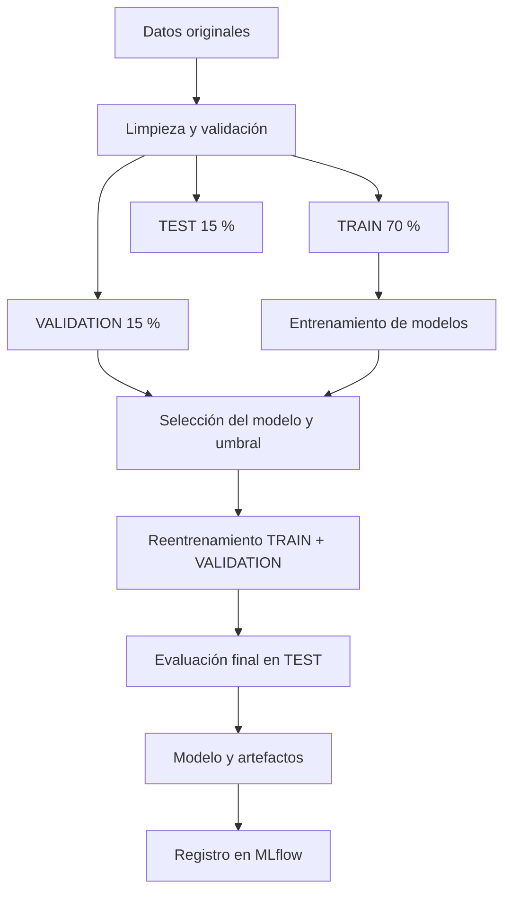

# Predicción de abandono de clientes — Telco Customer Churn

Proyecto de Machine Learning orientado a identificar clientes con riesgo de abandonar una empresa de telecomunicaciones.

El proyecto desarrolla un flujo reproducible que incluye análisis exploratorio, limpieza de datos, separación en TRAIN, VALIDATION y TEST, comparación de modelos, selección de umbral, evaluación final, registro de experimentos con MLflow y generación de predicciones.

## 1. Problema de negocio

La pérdida de clientes afecta los ingresos y aumenta los costos de adquisición de nuevos usuarios. El objetivo es detectar anticipadamente clientes con mayor probabilidad de abandono para priorizar acciones de retención.

El problema se plantea como una clasificación binaria:

- `0`: el cliente no abandona.
- `1`: el cliente abandona.

El modelo prioriza el **Recall**, debido a que para el negocio es importante detectar la mayor cantidad posible de clientes que realmente abandonarán.

## 2. Fuente de datos

Se utiliza el conjunto público [Telco Customer Churn de Kaggle](https://www.kaggle.com/datasets/blastchar/telco-customer-churn).

Archivo original:

```text
WA_Fn-UseC_-Telco-Customer-Churn.csv
```

Características principales:

- Registros originales: 7.043
- Registros después de la limpieza: 7.032
- Variable objetivo: `Churn`
- Predictores utilizados: 19
- Variables numéricas: 3
- Variables categóricas: 16
- Prevalencia de abandono: 26,58 %

La variable `customerID` se conserva únicamente como identificador y se excluye del entrenamiento.

## 3. Separación de los datos

La división se realiza de forma estratificada para mantener la proporción de clientes que abandonan en cada conjunto.

| Conjunto | Registros | Uso |
|---|---:|---|
| TRAIN | 4.922 | Entrenamiento de los modelos |
| VALIDATION | 1.055 | Comparación de modelos y selección del umbral |
| TEST | 1.055 | Evaluación final del modelo seleccionado |

Se comprobó que no existen clientes repetidos entre los tres conjuntos.

El conjunto TEST permanece aislado durante el entrenamiento y la selección del modelo.

## 4. Flujo del proyecto



## 5. Preprocesamiento

### Variables numéricas

- `tenure`
- `MonthlyCharges`
- `TotalCharges`

Transformaciones:

1. Imputación de valores faltantes mediante la mediana.
2. Estandarización con `StandardScaler`.

### Variables categóricas

Las 16 variables categóricas se procesan mediante:

1. Imputación con la categoría más frecuente.
2. Codificación `OneHotEncoder`.
3. Manejo de categorías desconocidas con `handle_unknown="ignore"`.

Todo el preprocesamiento se integra con el modelo mediante un `Pipeline` de scikit-learn, lo que evita fuga de información y mantiene consistencia entre entrenamiento y predicción.

## 6. Análisis exploratorio

Principales resultados:

- Los contratos mensuales presentan una tasa de abandono cercana al 42,7 %.
- Los clientes con fibra óptica presentan una tasa de abandono de aproximadamente 41,9 %.
- El pago mediante cheque electrónico presenta una tasa de abandono cercana al 45,3 %.
- Los clientes que abandonan muestran menor antigüedad.
- Los clientes que abandonan presentan cargos mensuales más altos.

Las visualizaciones se encuentran en `reports/figures/`.

## 7. Modelos comparados

Los siguientes resultados corresponden exclusivamente al conjunto VALIDATION:

| Modelo | Accuracy | Balanced Accuracy | Precision | Recall | F1 | ROC-AUC | PR-AUC |
|---|---:|---:|---:|---:|---:|---:|---:|
| DummyClassifier | 0.7336 | 0.5000 | 0.0000 | 0.0000 | 0.0000 | 0.5000 | 0.2664 |
| Regresión Logística L2 balanceada | 0.7479 | 0.7681 | 0.5170 | 0.8114 | 0.6316 | 0.8531 | 0.6542 |
| Random Forest balanceado | 0.7697 | 0.7546 | 0.5516 | 0.7224 | 0.6256 | 0.8341 | 0.6380 |
| Gradient Boosting | 0.8066 | 0.7163 | 0.6774 | 0.5231 | 0.5904 | 0.8497 | 0.6845 |

## 8. Modelo seleccionado

Se seleccionó la **Regresión Logística L2 balanceada**.

Aunque Gradient Boosting obtuvo mayor accuracy, la regresión logística consiguió mayor Recall y Balanced Accuracy en validación. Esto se ajusta mejor al objetivo de detectar clientes con riesgo de abandono.

El umbral se seleccionó únicamente con VALIDATION, buscando:

- Recall mínimo de 0,80.
- La mayor precisión posible dentro de esa restricción.

Umbral operativo seleccionado:

```text
0.5256
```

Resultados obtenidos durante la selección del umbral en VALIDATION:

| Precision | Recall | F1 |
|---:|---:|---:|
| 0.5294 | 0.8007 | 0.6374 |

Después de seleccionar el modelo y el umbral, el pipeline final se reentrenó utilizando TRAIN y VALIDATION, equivalentes a 5.977 registros.

## 9. Evaluación final en TEST

El conjunto TEST fue evaluado una sola vez después de cerrar las decisiones de modelamiento.

| Métrica | Resultado |
|---|---:|
| Accuracy | 0.7374 |
| Balanced Accuracy | 0.7392 |
| Precision | 0.5036 |
| Recall | 0.7429 |
| F1 | 0.6003 |
| ROC-AUC | 0.8224 |
| PR-AUC | 0.5835 |

### Matriz de confusión

| Resultado real | Predice: No abandona | Predice: Abandona |
|---|---:|---:|
| No abandona | 570 | 205 |
| Abandona | 72 | 208 |

El modelo detectó correctamente **208 de los 280 clientes que realmente abandonaron**, equivalente a un Recall de **74,29 %**.

También generó 205 falsos positivos. Esto significa que algunas acciones de retención podrían dirigirse a clientes que finalmente no abandonarían.

## 10. Registro de experimentos con MLflow

Los experimentos se registran localmente en MLflow.

Experimento:

```text
telco_customer_churn
```

Runs registrados:

1. `01_dummy_classifier`
2. `02_regresion_logistica`
3. `03_random_forest`
4. `04_gradient_boosting`
5. `05_modelo_productivo_v1`

Modelo registrado:

```text
telco_churn_model
```

Para iniciar la interfaz local:

```powershell
mlflow ui --backend-store-uri sqlite:///mlflow.db --port 5000
```

Luego ingresar a:

```text
http://127.0.0.1:5000
```

La base local `mlflow.db` y los artefactos internos de MLflow se excluyen del repositorio mediante `.gitignore`.

## 11. Estructura del repositorio

```text
telco-customer-churn-mle2/
├── data/
│   ├── raw/
│   └── processed/
├── models/
│   └── metadata_modelo_v1.json
├── notebooks/
│   ├── 01_preprocesamiento.ipynb
│   └── 02_modelamiento.ipynb
├── reports/
│   └── figures/
├── scripts/
│   ├── preprocess.py
│   ├── train_model.py
│   └── predict.py
├── src/
│   ├── __init__.py
│   ├── data_processing.py
│   ├── model_training.py
│   └── prediction.py
├── .gitignore
├── MODEL_CARD.md
├── README.md
└── requirements.txt
```

## 12. Instalación y ejecución

### Crear el entorno virtual

```powershell
python -m venv .venv
.venv\Scripts\Activate.ps1
```

### Instalar las dependencias

```powershell
pip install -r requirements.txt
```

### Incorporar los datos

Descargar el archivo desde Kaggle y guardarlo como:

```text
data/raw/WA_Fn-UseC_-Telco-Customer-Churn.csv
```

Los datos no se almacenan en GitHub.

### Ejecutar el preprocesamiento

```powershell
python scripts\preprocess.py
```

### Entrenar y guardar el modelo

```powershell
python scripts\train_model.py
```

### Generar predicciones

```powershell
python scripts\predict.py
```

## 13. Artefactos generados

- Modelo serializado: `models/modelo_logistico_churn_v1.joblib`
- Metadatos: `models/metadata_modelo_v1.json`
- Métricas finales: `reports/metricas_test_final.csv`
- Predicciones de TEST: `reports/predicciones_test_final.csv`
- Predicciones desde script: `reports/predicciones_script.csv`
- Figuras del análisis: `reports/figures/`

El archivo `.joblib` se genera localmente y no se almacena en GitHub.

## 14. Métricas operativas recomendadas

Además de las métricas offline, una implementación productiva debería monitorear:

- Cantidad de clientes evaluados.
- Cantidad y porcentaje de alertas generadas.
- Distribución de las probabilidades.
- Latencia de predicción.
- Valores faltantes o categorías desconocidas.
- Cambios en la distribución de las variables.
- Tasa real de abandono posterior.
- Precision y Recall cuando se conozcan los resultados reales.
- Diferencias entre las versiones del modelo.

## 15. Limitaciones

- El dataset corresponde a una muestra pública y no representa necesariamente una operación real.
- No se dispone de información temporal detallada.
- El modelo identifica asociaciones, pero no relaciones causales.
- El umbral depende del costo de los falsos positivos y falsos negativos.
- Antes de usarlo en producción sería necesario definir una estrategia de seguimiento, monitoreo y reentrenamiento.

## 16. Conclusiones

La regresión logística balanceada permite detectar aproximadamente tres de cada cuatro clientes que abandonan.

El modelo es interpretable, reproducible y supera ampliamente al modelo base en Recall, F1, ROC-AUC y PR-AUC.

Los resultados sugieren que el tipo de contrato, el servicio de internet, el método de pago, la antigüedad y los cargos mensuales contienen información relevante para anticipar el abandono.

## 17. Autora

**Valesca Fuenzalida**

Proyecto final del curso Machine Learning Engineering II.